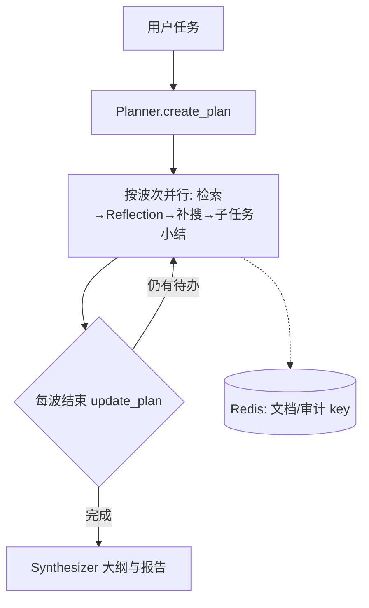

# Deepsearch_frame

面向**复杂开放域问题**的深度检索与研究框架：将「规划 → 多源检索 → 质量反思 → 分层合成」拆成清晰模块，在**可控成本**下逼近 Deep Research 类产品的信息获取与报告质量。

> 适合作为 **LLM 应用 / Agent 编排 / 检索增强** 方向的学习与二次开发基座；代码强调**可观测、可降级、边界清晰**。

---

## 亮点速览

| 维度 | 说明 |
|------|------|
| **流程编排** | **LangGraph**（`orchestrator/langgraph_runner.py`）：plan → 按波次并行子任务 → 每波后 `Planner.update_plan` 调整后续子任务 → 汇总合成；**串行**见 `orchestrator/runner.py`。CLI：`--engine graph` 或 `serial`，`--parallel N`（默认 3）；全局/子任务级**检索预算**不变。 |
| **状态与内存** | 检索文档、audit、reflection 等大对象写入 **Redis**（`utils/redis_store.py`），图状态只保留 **key**，避免 state 膨胀；`.env` 配置 `REDIS_HOST` / `REDIS_PORT` 等。 |
| **子任务顺序** | `utils/subtask_order.py`：对 `s1`、`s2`… 按**数字序号**排序，保证列表与合并日志阅读顺序一致。 |
| **联网检索** | 统一 `Retriever` 抽象；**Tavily / DuckDuckGo** 可切换；可选 **`tools/page_reader` 拉取 HTML 正文**与 **OCR** 补充图中文字。 |
| **证据治理** | 合并结果 **>10 条** 时 **TF-IDF Top-10**；单条 **>2000 字** 时可选 **query-aware 本地小模型压缩**，失败则截断。 |
| **LLM 接入** | `utils/my_llm`：厂商 + 模型枚举、独立 **httpx** 超时/连接池、**max_retries**；支持通义 / DeepSeek 等 OpenAI 兼容端点。 |
| **可观测** | **子任务级**日志 `logger/subtasks/{run_id}/` + 运行结束按序**合并**到 `logger/records/`；控制台输出**本波并行 id**与 **plan 更新差异**（新增/删除/字段变更）。会话级 txt 仍见 `logger/records/`。 |
| **交互与评估** | **Gradio**（`view/gradio_app.py`）：子任务列表、并行「当前任务」展示、输出后人工反馈；**Ragas** 评估示例见 `third_party/rag_eval/evals.py`（可选）。 |

---

## 架构与数据流（Graph 模式概要）



**设计要点**

1. **先结构化再检索**：Planner 产出带优先级的子问题；Reflection 按子任务判断证据是否充分。  
2. **波次并行 + 动态规划**：每波最多并行 `N` 个子任务；波次结束后用已完成摘要触发 **plan 更新**，后续子任务可增删改。  
3. **搜索与正文解耦**：snippet 快但信息密度差；正文与 OCR 为可选增强，带超时与条数上限。  
4. **证据先裁剪再进大模型**：相关性 Top-K + 超长压缩/截断，降低噪声与费用。  
5. **Redis 外置大对象**：避免 LangGraph state 序列化过大；会话结束或 UI 下一问时可清理（见应用逻辑）。

---

## 目录结构（与职责）

```
Deepsearch_frame/
├── orchestrator/       # runner.py 串行主循环；langgraph_runner.py LangGraph + 波次并行
├── planner/            # 任务 → Plan；支持 update_plan 反馈更新
├── retrievers/         # WebRetriever（Tavily / DDG）
├── reflection/         # 证据充分性 + 补搜建议
├── synthesizer/        # 子任务摘要 → 大纲 → 报告
├── memory/             # MemoryHub 中间状态
├── tools/              # web_search、page_reader
├── utils/              # LLM、Redis、子任务排序、doc 排序、query 压缩、env
├── logger/             # SessionStepLogger；records/ 合并日志；subtasks/ 子任务日志；feedback/ UI 反馈（运行生成，见 .gitignore）
├── view/               # Gradio 可视化入口
├── third_party/rag_eval/  # Ragas 评估示例（可选）
├── schemas/            # Pydantic 模型
├── test/agent_test.py  # CLI 入口（graph/serial、parallel）
└── requirements.txt
```

---

## 快速开始

**环境**：Python 3.10+ 推荐。

```bash
git clone <你的仓库地址>.git
cd Deepsearch_frame
pip install -r requirements.txt
```

**配置**（勿将真实 Key 提交到 Git）：

- LLM：通义 / DeepSeek 等（`BAILIAN_*`、`DEEPSEEK_*`，见 `utils/env_utils.py`）  
- 联网：`TAVILY_API_KEY`（可选；未配置可走 DuckDuckGo）  
- **Redis**（Graph 模式推荐）：`REDIS_URL`（如 `redis://localhost:6379/0`），或 `REDIS_HOST` / `REDIS_PORT` / `REDIS_DB` / `REDIS_PREFIX`  
- 本地压缩：`COMPRESS_MODEL_ID`、`ENABLE_QUERY_COMPRESS`  
- OCR：本机安装 [Tesseract](https://github.com/tesseract-ocr/tesseract)

**CLI 运行**（从项目根目录）：

```bash
python test/agent_test.py --task "你的研究问题"
# python test/agent_test.py --engine graph --parallel 3   # 默认 graph + 并行度 3
# python test/agent_test.py --engine serial               # 仅串行 orchestrator/runner.py
# python test/agent_test.py --no-fetch-page --no-file-log
```

若本地另有根目录 `main.py` 入口，参数与上表一致。

**Gradio**：

```bash
python view/gradio_app.py
```

日志：合并报告与步骤见 `logger/records/`；子任务分文件见 `logger/subtasks/`。

**可选：Ragas 评估**（无标准答案时的检索质量指标示例）：在项目根目录配置环境变量后运行 `python third_party/rag_eval/evals.py`。常用变量：`EVAL_LOG_PATH`（步骤日志文件或目录）、`EVAL_TASK`、`EVAL_FETCH_FULL_PAGE`；评审 LLM 等与 Ragas 要求一致，详见脚本内注释。

---

## 技术栈

- **编排**：LangGraph（`langgraph==1.0.3`）、LangChain ChatOpenAI、Pydantic  
- **缓存**：Redis（`redis` 客户端）  
- **检索与网页**：httpx、trafilatura、BeautifulSoup、可选 Tavily / DDG  
- **相关性**：scikit-learn（字符 TF-IDF）  
- **可选压缩**：Hugging Face `transformers` + PyTorch  
- **可选 OCR**：pytesseract + Pillow  
- **UI**：Gradio 5.50  
- **评估（可选）**：Ragas（vendored 或依赖安装）

---

## 局限与可扩展方向

- Planner / Reflection / update_plan 依赖 LLM 与 JSON 解析，已做容错，极端情况需调 prompt。  
- Vector / Hybrid 等在 `retrievers` 中可扩展。  
- Ragas 评估脚本需单独配置评审 LLM 与数据集路径。

---

## License

若开源发布，请在此补充许可证（如 MIT）；未指定前默认保留所有权利。
