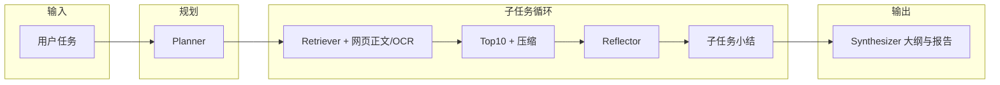

# Deepsearch_frame

面向**复杂开放域问题**的深度检索与研究框架：将「规划 → 多源检索 → 质量反思 → 分层合成」拆成清晰模块，在**可控成本**下逼近 Deep Research 类产品的信息获取与报告质量。

> 适合作为 **LLM 应用 / Agent 编排 / 检索增强** 方向的学习与二次开发基座；代码强调**可观测、可降级、边界清晰**。

---

## 亮点速览

| 维度 | 说明 |
|------|------|
| **流程编排** | Planner 子任务拆解 → 子任务循环内「检索 → Reflection → 可选补搜」→ Synthesizer 大纲 + 成文；全局与子任务级**检索预算**，避免无限循环。 |
| **联网检索** | 统一 `Retriever` 抽象；**Tavily / DuckDuckGo** 可切换；搜索仅给摘要时信息不足 → **`tools/page_reader` 拉取 HTML 正文**（trafilatura）并可选 **OCR 补充图中文字**（非多模态语义，仅文字）。 |
| **证据治理** | 合并结果 **>10 条** 时按查询做 **TF-IDF（字符 n-gram）相关性 Top-10**；单条正文 **>2000 字** 时可选 **query-aware 本地小模型压缩**（目标 ~500 字），失败则截断，主流程不崩。 |
| **LLM 接入** | `utils/my_llm`：**厂商 + 模型枚举**懒加载、独立 **httpx** 超时/连接池、**max_retries**；支持通义 / DeepSeek 等 OpenAI 兼容端点。 |
| **可观测** | `logger/records/` 按会话时间戳输出 **txt 步骤日志**（每步 INPUT/OUTPUT），便于复盘与调试。 |

---

## 架构与数据流



**设计思路（个人取舍）**

1. **先结构化再检索**：复杂问题不直接「一问一搜」，而是先产出可执行的子问题列表（带优先级），便于 Reflection 按子任务判断证据是否充分。  
2. **搜索 API 与页面正文解耦**：API 返回的 snippet 延迟低但信息密度差；正文抓取与 OCR 作为**可选增强**，并用超时与条数上限控制成本。  
3. **证据层先压缩再进大模型**：反思与合成阶段不假设「无限上下文」——相关性裁剪 + 超长文本压缩/截断，减少噪声与费用。  
4. **工业级 HTTP 与可降级**：LLM 与网页请求均带超时与重试语义；本地压缩模型、Tesseract、sklearn 等**缺失或失败时自动降级**，保证整条链路可跑通。

---

## 目录结构（与职责）

```
Deepsearch_frame/
├── orchestrator/       # 主循环与状态衔接
├── planner/            # 任务 → Plan（JSON 结构化输出）
├── retrievers/         # WebRetriever；向量/混合检索接口预留
├── reflection/         # 证据充分性 + 补搜建议
├── synthesizer/        # 子任务摘要 → 大纲 → 报告
├── memory/             # MemoryHub 中间状态
├── tools/              # web_search、page_reader（正文 + OCR）
├── utils/              # LLM 工厂、doc 排序、query 压缩、json 解析、env
├── logger/             # SessionStepLogger + records/*.txt
├── schemas/            # Pydantic 共享模型
├── main.py             # CLI 入口
└── requirements.txt
```

---

## 快速开始

**环境**：Python 3.10+ 推荐。

```bash
git clone <你的仓库地址>.git
cd Deepsearch_frame
pip install -r requirements.txt
```

**配置**：复制环境变量模板（勿将真实 Key 提交到 Git）：

- 通义 / DeepSeek 等：`BAILIAN_*` 或 `DEEPSEEK_*`（见 `utils/env_utils.py`）  
- 联网搜索：可选 `TAVILY_API_KEY`；未配置时走 DuckDuckGo  
- 本地压缩模型：可选 `COMPRESS_MODEL_ID`、`ENABLE_QUERY_COMPRESS`  
- OCR：需本机安装 [Tesseract](https://github.com/tesseract-ocr/tesseract)（中文需语言包）

**运行**：

```bash
python main.py --task "你的研究问题"
# python main.py --no-fetch-page      # 不拉网页正文（更快）
# python main.py --no-file-log        # 不写步骤 txt
```

单次运行的**步骤记录**默认写入 `logger/records/`，文件名形如 `YYYY-MM-DD_HH-MM-SS.txt`（Windows 下文件名不含冒号）。

---

## 技术栈

- **编排与模型**：LangChain ChatOpenAI（OpenAI 兼容 API）、Pydantic  
- **检索与网页**：httpx、trafilatura、BeautifulSoup、可选 Tavily / DDG  
- **相关性**：scikit-learn（字符 TF-IDF + 余弦相似度）  
- **可选压缩**：Hugging Face `transformers` + PyTorch 本地小模型  
- **可选 OCR**：pytesseract + Pillow  

---

## 局限与可扩展方向

- **Planner / Reflection** 依赖 LLM 输出 JSON，已做解析容错，极端情况下需调 prompt。  
- **Vector / Hybrid / Text2SQL** 在 `retrievers` 中为接口占位，可按业务接入。  
- **LangGraph**：当前为显式主循环实现，便于阅读；若需复杂分支与可视化，可迁移为图编排而不改模块边界。  

---

## License

若开源发布，请在此补充许可证（如 MIT）；未指定前默认保留所有权利。
